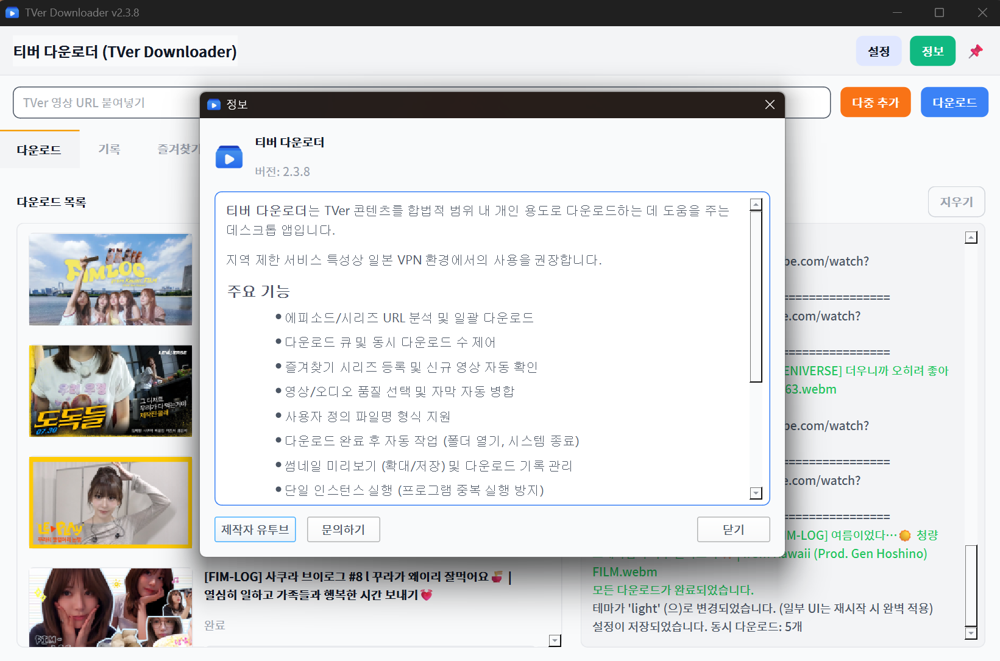

# 티버 다운로더 (TVer Downloader)

📌 [**Repository**](https://github.com/deuxdoom/TVerDownloader)  
🐞 [**Issues**](https://github.com/deuxdoom/TVerDownloader/issues)  
📦 [**Releases**](https://github.com/deuxdoom/TVerDownloader/releases)

--- 

**TVer Downloader**는 일본 TVer 플랫폼의 동영상을 다운로드하기 위한 오픈소스 도구입니다.  
PyQt6와 yt-dlp를 활용해 직관적인 GUI와 다양한 사용자 설정 기능을 제공합니다.

---

## 📦 시스템 요구 사항

- Windows 10 / 11 (x64)
- 인터넷 연결 (첫 실행 시 구성 요소 자동 준비), 일본 VPN 필수
- ⚠ [Microsoft Visual C++ 재배포 가능 패키지 (x64)](https://aka.ms/vs/17/release/vc_redist.x64.exe) 를 반드시 설치해야 합니다.
---

## 📝 개요

- **목적**: TVer의 영상들을 일본VPN을 통해 다운로드하고 재생 및 관리
- **릴리스**: [v2.2.0](https://github.com/deuxdoom/TVerDownloader/releases/tag/v2.2.0)
- **라이선스**: MIT
- **언어**: Python 3.8+

---

## ✨ 주요 기능

- 단일 및 다중 다운로드 지원
- 다운로드 엔진 yt-dlp + ffmpeg 자동 최신화
- 시리즈 즐겨찾기 등록을 통한 자동 다운로드
- 화질 선택 기능 (최상, 1080p, 720p, 오디오 전용)
- 파일명 커스터마이징 (시리즈명, 날짜 등)
- 후속 작업 지원 (폴더 열기, 시스템 종료 등)
- 썸네일 클릭 확대 및 완료 목록 더블 클릭시 재생 기능
- 진행/로그 표시 강화 
- 최신 버전 업데이트 알림
- 항상위 기능으로 다른 작업시에도 다운로드 진행 상황 확인
- 트레이로 감추기 및 복원 가능
 
---

## 🛠 사용 방법

1. **URL 추가** 버튼으로 TVer 링크 입력
2. **설정** 탭에서 화질, 파일명, 테마 등을 조정
3. **다운로드 시작** 버튼 클릭
4. 진행바로 상태 확인

---

## 🔧 개발 정보

- **GUI 프레임워크**: PyQt6
- **다운로드 엔진**: yt-dlp
- **설정 방식**: JSON 기반
- **제약 사항**: 다중 URL 미지원, 네트워크 의존

---

## 🤝 개발자 응원

- 응원의 구독! [YouTube](https://www.youtube.com/@LE_SSERAFIM?sub_confirmation=1)

---

## 🗺️ 로드맵

- 여러분의 아이디어를 기다립니다!
- 기타 등등 생각만 많음 o_o;

---

## ❓ 자주 묻는 질문 (FAQ)

- **0%에서 멈춤/403** → 일본 **VPN**이 꺼져 있거나 연결 상태가 불안정할 때 발생합니다.
- **병합 실패 / 오디오 추출 실패** → FFmpeg 준비 완료 여부를 로그에서 확인 후 재시도하세요.
- **보안 경고** → 일부 보안/백신 프로그램이 악성코드 또는 트로이목마로 오진 할 수 있습니다.  
  전혀 문제없으니 안심하고 사용하십시오.

---

## 📜 라이선스 / 고지 / 문의

- 오픈소스 사용 고지 및 링크는 앱 **정보(About)** 창에서 확인할 수 있습니다.
- 문의: 앱 상단 **정보 → 문의하기**
- 개발자: 앱 상단 **정보 → 유튜브**