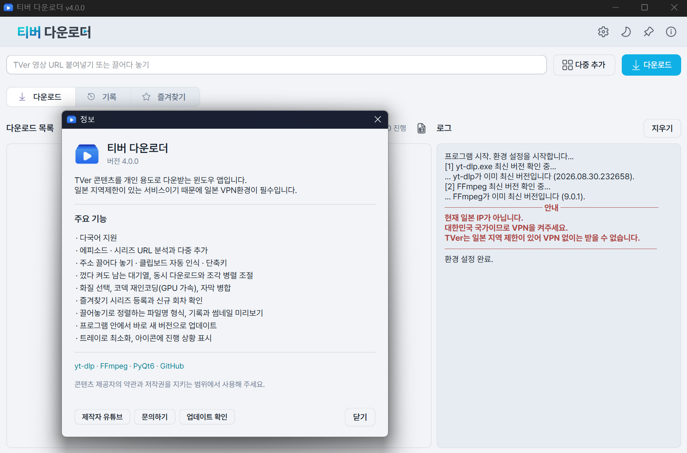

#  티버 다운로더 (TVer Downloader)

[](https://refer-nordvpn.com/RRXwGuSQXTe)
[](https://toon.at/donate/deuxdoom)

[](https://github.com/deuxdoom/TVerDownloader/releases/latest)
[](https://github.com/deuxdoom/TVerDownloader/releases/latest)
[](https://github.com/deuxdoom/TVerDownloader/releases)
[](https://opensource.org/licenses/MIT)  
[](https://github.com/deuxdoom/TVerDownloader)
[](https://www.python.org/)
[](https://pypi.org/project/PyQt6/)  
[](https://github.com/yt-dlp/yt-dlp)
[](https://ffmpeg.org/)

---

## 📜 간단 소개

- **TVer Downloader**는 일본 티버 스트리밍 플랫폼의 동영상을 다운로드하도록 도와주는 GUI 기반의 프로그램입니다.
- PyQt6 기반의 직관적인 인터페이스와 yt-dlp/FFmpeg 자동 업데이트 등의 기능을 갖추고 있습니다.
- 기본적으로 TVer의 영상 다운로드가 주목적이지만, YouTube의 영상 역시 다운로드가 가능합니다.

---

## 💻 시스템 요구 사항

- Windows 10 / 11 (x64)
- Python 3.10 이상 (소스로 직접 실행할 경우)
- 인터넷 연결 및 일본 VPN 필요
- 런타임 에러가 발생할 경우: [Microsoft Visual C++ 재배포 가능 패키지 (x64)](https://aka.ms/vs/17/release/vc_redist.x64.exe)

---

## ✨ 주요 기능

### 다운로드
- 최신 **yt-dlp** 및 **FFmpeg** 자동 다운로드 및 업데이트
- **단일 및 다중 다운로드** (시리즈 URL 자동 분해 지원)
- **동시 다운로드 수 조정** (1 ~ 20개)
- **화질 선택** (최상 / 1080p / 720p)
- **대역폭 제한** 설정 (1 / 5 / 10 / 50 MB/s)
- **시리즈 분석 시 제외 키워드** 설정 (기본값: 予告, SP, ダイジェスト 등)

### 파일 및 변환
- **파일명 자유 커스터마이징** 및 순서 설정 지원
- 경로가 Windows 길이 제한을 넘을 경우 **폴더 구조를 유지한 채 이름 자동 축소**
- **선호 코덱 설정** — 기본값은 `원본 유지`로 불필요한 재인코딩을 하지 않음 (필요 시 AVC / HEVC / VP9 / AV1 선택 가능)
- **하드웨어 인코딩 가속** 지원 (NVIDIA NVENC / Intel QSV / AMD AMF)
- **컨테이너 변환** (MP4 → AVI / MOV, MP3 오디오 추출)

### 자막
- **일본어 자막 다운로드** 지원
- **영상에 자막 포함**(embed) 또는 **별도 파일로 저장** 선택
- 별도 저장 시 **VTT / SRT 형식** 선택 가능

### 인터페이스
- **썸네일 클릭 확대**, **완료 목록 더블클릭 재생**
- **트레이 알림**, **항상 위**, **진행률 표시 및 로그 강화**
- **라이트 / 다크 테마 전환 기능** (기본값 라이트)
- **다운로드 한 영상 및 즐겨찾기 시리즈 목록 자동 백업**
- **썸네일 캐시 관리** 기능
- **가볍고 직관적인 UI** — 불필요한 기능 최소화, UX 중심 설계

---

## 🚀 사용 방법

1. TVer 영상 *URL*을 입력 창에 붙여넣기
2. **설정** 메뉴에서 저장 폴더, 화질, 동시 다운로드 수, 파일명 규칙 등 조정
3. **다운로드 시작** 버튼 클릭
4. 진행률·로그·썸네일로 실시간 상태 확인
5. **완료된 목록** 더블 클릭으로 영상재생

### 설정 탭 구성

| 탭 | 내용 |
|---|---|
| 일반 | 저장 폴더, 동시 다운로드 수, 테마 |
| 파일명 | 파일명 구성 요소 선택 및 순서 지정, 미리보기 |
| 화질 | 다운로드 화질, 선호 코덱, 하드웨어 가속, 상세 품질(CRF/CQ) |
| 자막 | 자막 다운로드 여부, 영상 포함/별도 저장, 자막 형식 |
| 고급 | 대역폭 제한, 컨테이너 변환, 시리즈 제외 키워드, SSL 인증서 검증 |
| 캐시 | 썸네일 캐시 크기 확인 및 삭제 |

---

## ❗ 주의 사항

- 본 프로그램은 **개인적인 아카이빙 목적**으로만 사용해야 하며, 상업적 이용이나 재배포는 금지됩니다.
- TVer는 일본 내 서비스이므로, **일본 VPN 환경**에서만 정상 동작합니다.
- 다운로드한 콘텐츠의 **저작권 및 이용 약관**을 반드시 준수하세요.
- **Windows에서 'PC 보호' 또는 '서명되지 않은 파일' 경고**가 표시될 수 있습니다.  
이 프로그램은 직접 빌드한 오픈소스 프로젝트로, 악성코드가 없으니 안심하고 실행해도 됩니다.
- **업데이트 시** 반드시 `TVerDownloader.exe` **파일**과 `_internal` **폴더**를 **함께 덮어쓰기** 해야 합니다.
- 네트워크 환경 문제로 다운로드가 실패할 경우, **설정 > 고급**의 `SSL 인증서 검증 건너뛰기`를 활성화하면 해결될 수 있습니다. 단, 보안상 필요한 경우에만 사용하세요.

---

## 🔧 개발 정보

- **GUI**: PyQt6
- **다운로드 엔진**: yt-dlp + FFmpeg (자동 최신화 포함)
- **설정 저장**: JSON 기반(config / history / favorites)
- **안정성**: 예외 발생 시 크래시 로그(`TVerDownloader_crash.log`) 저장

---

## 📂 프로젝트 트리구조

```
📦 TVerDownloader
├─ 🐍 TVerDownloader.py                     — Entry point / main window bootstrap
├─ 📁 src
│  ├─ 🐍 __init__.py
│  ├─ 🐍 utils.py                            — Config, filename template, helpers (open file, crash log)
│  ├─ 🐍 download_manager.py                 — Queue & concurrency orchestrator
│  ├─ 🐍 series_parser.py                    — Series URL parse coordinator (queues → thread)
│  ├─ 🐍 updater.py                          — GitHub releases/latest checker
│  ├─ 🐍 dialogs.py                          — SettingsDialog (일반/파일명/화질/자막/고급/캐시)
│  ├─ 🐍 about_dialog.py                     — About window (HTML features list)
│  ├─ 🐍 bulk_dialog.py                      — Multi-URL add dialog
│  ├─ 🐍 series_dialog.py                    — Episode selection for series (thumb preview)
│  ├─ 🐍 widgets.py                          — Download/History/Favorite item widgets + thumb cache
│  ├─ 🐍 history_store.py                    — urlhistory.json + rolling backups
│  ├─ 🐍 favorites_store.py                  — favorites.json + backups
│  ├─ 🐍 qss.py                              — Light/Dark QSS builder
│  ├─ 🐍 icon.py                             — App icon (Base64 → QIcon)
│  ├─ 📁 threads
│  │  ├─ 🐍 __init__.py
│  │  ├─ 🐍 setup_thread.py                  — Auto-setup yt-dlp & FFmpeg (→ bin/)
│  │  ├─ 🐍 series_parse_thread.py           — Parse series → episode list (키워드 제외 적용)
│  │  ├─ 🐍 download_thread.py               — Download + mux + subtitles + progress parsing
│  │  └─ 🐍 conversion_thread.py             — Optional format/codec conversion
│  └─ 📁 ui
│     ├─ 🐍 __init__.py
│     └─ 🐍 main_window_ui.py                — Build main UI (header, input bar, tabs, tray)
├─ 🧾 Generated at runtime
│  ├─ 📁 bin/                                 — yt-dlp.exe, ffmpeg.exe, ffprobe.exe (자동 설치)
│  ├─ 📄 downloader_config.json               — User settings
│  ├─ 📄 urlhistory.json                      — Download history
│  ├─ 📄 favorites.json                       — Favorite series
│  ├─ 📁 thumbnails/                          — Cached thumbnails
│  ├─ 📁 historybak/                          — History backups
│  ├─ 📁 favoritbak/                          — Favorites backups
│  └─ 📄 TVerDownloader_crash.log             — Crash logs
├─ 📄 .gitignore
├─ 📄 README.md
├─ 🖼️ logo.png
└─ 🖼️ main.png
```

---

## 🤝 기여 및 응원

- 버그 제보 및 코드 기여: [Issues](https://github.com/deuxdoom/TVerDownloader/issues)
- 상단의 [NordVPN 링크](https://refer-nordvpn.com/RRXwGuSQXTe) 로 가입시 개발자에게도 도움이 됩니다.
- 개발자 유투브: [YouTube 구독](https://www.youtube.com/@LE_SSERAFIM?sub_confirmation=1)
- Star 별 ⭐을 눌러주시면 큰 힘이 됩니다.

---

## 📄 라이선스

[MIT License](https://opensource.org/licenses/MIT)
