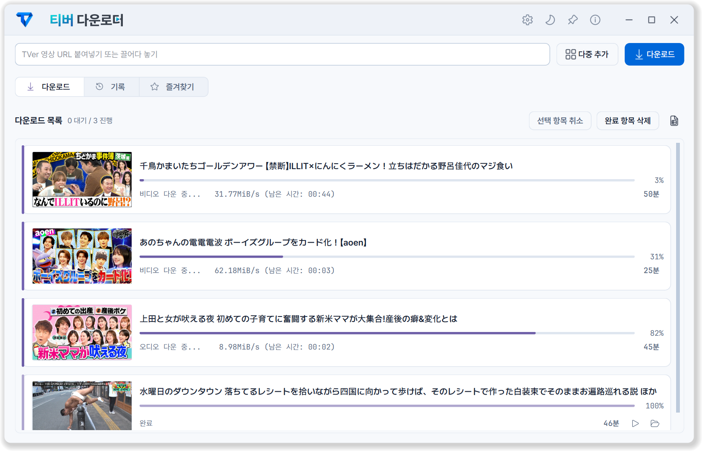

#  티버 다운로더 (TVer Downloader)

[](https://refer-nordvpn.com/RRXwGuSQXTe)
[](https://toon.at/donate/deuxdoom)

[](https://github.com/deuxdoom/TVerDownloader/releases/latest)
[](https://github.com/deuxdoom/TVerDownloader/releases/latest)
[](https://github.com/deuxdoom/TVerDownloader/releases)
[](#-라이선스-및-저작권-license--copyright)  
[](https://github.com/deuxdoom/TVerDownloader)
[](https://www.python.org/)
[](https://pypi.org/project/PyQt6/)  
[](https://github.com/yt-dlp/yt-dlp)
[](https://ffmpeg.org/)

---

## 📌 간단 소개

- **TVer Downloader**는 일본 티버 스트리밍 플랫폼의 동영상을 다운로드하도록 도와주는 GUI 기반의 프로그램입니다.
- PyQt6 기반의 직관적인 인터페이스와 yt-dlp/FFmpeg 자동 업데이트 등의 기능을 갖추고 있습니다.
- **다국어를 지원합니다.** OS의 주 언어에 따라 해당 언어로 나오고, 설정에서 직접 고를 수 있습니다.
- 기본적으로 TVer의 영상 다운로드가 주목적이지만, YouTube의 영상 역시 다운로드가 가능합니다.

---

## 💻 시스템 요구 사항

- Windows 10 / 11 (x64)
- Python 3.10 이상 (소스로 직접 실행할 경우)
- 인터넷 연결 및 일본 VPN 필요
- 런타임 에러가 발생할 경우: [Microsoft Visual C++ 재배포 가능 패키지 (x64)](https://aka.ms/vs/17/release/vc_redist.x64.exe)

---

## ✨ 주요 기능

### 주소 넣기

- **입력창에 붙여넣기** 후 Enter 또는 다운로드 버튼
- **끌어다 놓기** — 브라우저 주소창에서 창으로 직접. 여러 개를 놓으면 다중 추가 창이 채워진 채 열림
- **클립보드 자동 인식** (기본 켜짐, 설정 > 일반) — 복사한 TVer 주소를 입력창에 넣어 줌. 주소가 연달아 오면 다중 추가 창에 모아 줌. TVer 주소가 아닌 내용에는 반응하지 않고, 다운로드가 저절로 시작되지도 않음
- **다중 추가 창** — 여러 줄에 주소를 한꺼번에
- **주소가 아닌 것은 미리 걸러 줌** — 실수로 문장이나 낱말을 붙여넣고 다운로드를 눌러도 받으러 가지 않고 알림 창을 띄움. 여러 줄일 때는 주소가 아닌 줄만 건너뜀

### 다운로드

- 최신 **yt-dlp** 및 **FFmpeg** 자동 다운로드 및 업데이트
- **단일 및 다중 다운로드** (시리즈 URL 자동 분해 지원)
- **동시 다운로드 수 조절** (1 ~ 20개) — 차례를 기다리는 항목도 **제목과 미리보기 그림을 먼저 불러와** 무엇이 걸려 있는지 바로 보임
- **조각 병렬 받기** (1 ~ 16개, 기본 4) — 영상 하나를 이루는 조각을 한꺼번에 받아 속도를 끌어올림. 동시 다운로드 수와 **곱한 값이 20개를 넘으면** 연결 안정성을 위해 저장을 막고 이유를 알려 줌
- **화질 선택** (최상 / 1080p / 720p)
- **시리즈 분석 시 제외 키워드** 설정 (기본값: 予告, ティザー, ダイジェスト, メイキング, ナビ, 解説放送版)
- **선택 항목 취소** — 받는 중인 것은 멈추고, 기다리는 중인 것은 목록에서 뺌. 여러 개를 골라 한 번에
- **대기열 이어받기** — 프로그램을 꺼도 대기 중이던 항목과 받다 만 항목이 제목·미리보기 그림과 함께 다음 실행에 `대기` 상태로 되살아남. **저절로 받기 시작하지는 않고** 목록 위의 `대기열 시작`을 눌러야 함 (VPN을 켜기 전에 시작해 전부 실패하는 것을 막기 위함)
- **음성 없음 감지** — 다 받은 뒤 소리가 들어 있는지 확인해, 화면만 있으면 `음성 없음`으로 표시하고 다시 받을 수 있게 남겨 둠
- **통신이 불안정할 때 자동 재시도** — 시리즈 확인과 영상 정보 확인이 한 번에 실패하지 않고 몇 번 더 시도

### 프로그램 업데이트

- **프로그램 안에서 바로 교체** — 새 버전 안내창의 `지금 업데이트`를 누르면 알아서 내려받아 바꿔 줌. 브라우저에서 zip을 받아 덮어쓸 필요 없음
- **설정 · 기록 · 즐겨찾기는 그대로 유지** — 교체 대상은 실행 파일과 `_internal` 폴더뿐
- **`내역 확인`** — 받기 전에 무엇이 바뀌었는지 먼저 확인
- **원할 때 직접 확인** — 정보 창의 `업데이트 확인`. 자동 확인은 설정 > 일반에서 끌 수 있음
- **교체에 실패하면 이전 버전으로 되돌림** — 백업은 다음 실행 때 자동으로 정리됨

### 파일 및 변환

- **파일명 구성 요소 커스터마이징** — 항목을 **끌어놓아** 순서를 바꾸고, 실제 방송 예시로 결과를 미리 확인. 구성 요소마다 **색이 붙어** 어느 것이 파일명의 어디가 되는지 한눈에 보이고, 체크를 풀면 그 줄이 흐려짐
- 경로가 Windows 길이 제한을 넘을 경우 **폴더 구조를 유지한 채 이름 자동 축소**
- **선호 코덱 설정** — 기본값은 `원본 유지`로 불필요한 재인코딩을 하지 않음 (필요 시 AVC / HEVC 선택 가능)
- **재인코딩 시 소리도 AAC로 함께 변환** — 영상만 바꾸고 소리를 Opus로 남기면 편집 도구에서 오디오 트랙이 잡히지 않음. 비트레이트는 원본에 맞춰 정하고(96k~192k), 원본이 이미 AAC면 다시 만들지 않고 그대로 옮김
- **품질 값은 코덱별로 검증된 값이 자동 적용** — CRF/CQ를 직접 넣는 칸은 없음. 해상도·프레임레이트에 맞는 level과 색 정보도 함께 지정
- **하드웨어 인코딩 가속** 지원 (NVIDIA NVENC)
- **재인코딩은 한 번에 하나씩** — 다운로드는 그동안에도 계속 진행되고, 변환할 것이 여럿이면 차례로 처리함. 하나가 이미 모든 코어를 쓰므로 겹쳐 돌려도 총 시간이 줄지 않고 서로 느려지기만 함
- **영상 파일에 썸네일 포함** (설정 > 고급) — 탐색기나 다른 재생기에서도 미리보기 그림이 보임
- 재인코딩을 쓰지 않을 때는 관련 설정이 **흐리게 표시**되어 지금 해당 없음을 알려줌

### 자막

- **일본어 자막 다운로드** 지원
- **영상에 자막 포함**(embed) 또는 **별도 파일로 저장** 선택
- 별도 저장 시 **VTT / SRT 포맷** 선택 가능

### 인터페이스

- **다운로드 카드** — 16:9 썸네일, 상태를 나타내는 세로 색 띠, 진행 중에만 은은하게 밝기가 변하는 애니메이션
- **영상 길이 표시** — 재생 · 폴더 아이콘 왼쪽에 `45분`처럼 굵게. 1분이 안 되면 `45초`로, 길이를 모르면 표시하지 않음
- **완료 시 재생 · 폴더 열기 버튼 상시 노출** (더블클릭 재생도 그대로 동작). 마우스를 올리면 재생은 초록, 폴더 열기는 노랑으로 물듦
- **목록에서 오른쪽 클릭** — 파일 재생 · 파일 위치 열기 · 썸네일 저장을 한자리에서
- **기록 탭에서 오른쪽 클릭** — 브라우저에서 열기 · 다시 다운로드 · 파일 위치 열기(파일이 남아 있을 때만) · 기록에서 삭제
- **기록 탭 여러 항목 한 번에 삭제** — 정렬 드롭다운 왼쪽 `삭제` 버튼으로 선택한 기록을 목록에서 지움. 받아 둔 파일은 남음
- **기록 검색은 타자를 멈춘 뒤 한 번만 그림** — 글자마다 목록을 다시 그리지 않아 기록이 쌓여도 입력이 매끄러움(기록 1,000개 기준 1,143ms → 56ms). 검색 대상은 기록 전체
- **기록은 30개로 시작해 내릴수록 이어짐** — 목록 끝까지 내리면 15개씩 더 불러와 최대 120개까지 이어짐. 카드를 만드는 값을 끝까지 내려 본 사람만 나눠 내게 한 것. 이미 펼쳐 둔 만큼은 다운로드가 끝나 목록이 갱신되어도 접히지 않고, 검색어나 정렬을 바꿀 때만 처음 30개로 돌아감. 120개를 넘는 것은 개수로 알리고 검색으로 찾음
- **목록 스크롤은 윈도우 휠 설정을 따르지 않음** — 세 목록 모두 휠 한 칸에 화면의 35%만 움직임. 항목 단위로 굴리면 윈도우의 `한 번에 몇 줄` 설정에 따라 카드가 그 수만큼 통째로 건너뛰어, 5줄로 둔 화면에서는 한 칸에 화면보다 많은 520px이 지나가며 그 사이 항목이 눈에 닿지도 않았음
- **세그먼트 컨트롤 탭** — 다운로드 / 기록 / 즐겨찾기. 이름에 마우스를 올리면 한 줄 설명
- **빈 목록 안내** — 세 목록이 비어 있으면 아이콘과 함께 무엇을 하면 되는지 알려 줌. 검색 결과가 없을 때는 그에 맞는 문구
- **로그 창 접기/펴기** — 다운로드 목록 오른쪽 끝 버튼으로 여닫고, 접어 둔 상태는 다음 실행에도 유지
- **즐겨찾기 2열 카드** (최대 20개) — 창이 좁아지면 자동으로 1열. 새 영상이 3개 이상 나오면 대기열에 바로 넣지 않고 받을 것을 고르는 창을 띄움
- **시작할 때 즐겨찾기 확인** (기본 꺼짐, 설정 > 일반) — TVer는 일본 지역 제한이 있어 VPN보다 프로그램이 먼저 뜨면 확인이 전부 실패로 끝나므로 꺼 두었음. 평소에는 즐겨찾기 탭의 `모두 갱신`으로 원할 때만 확인
- **시작할 때 지역 확인** (항상 켜짐) — 준비가 끝나면 로그 `안내` 칸에 실제 확인 결과. 일본이면 초록빛으로 `현재 일본 IP 입니다`, 아니면 붉은색으로 `현재 일본 IP가 아닙니다 / OO 국가이므로 VPN을 켜주세요`. 확인하지 못했으면 그 사실을 밝히고 일반 안내를 보여 줌(실패를 '일본 아님'으로 말하지 않음). 알려 줄 뿐 다운로드를 막거나 창을 띄우지 않고, IP 주소는 로그에 적지 않음
- **버튼 색으로 성격 구분** — 마우스를 올리면 되돌릴 수 없는 것(선택 항목 취소 · 즐겨찾기 삭제 · 기록 삭제)은 진한 빨강, 목록만 정리하는 것(완료 항목 삭제)은 주황, 즐겨찾기 `추가`는 파랑, `모두 갱신`은 초록
- **라이트 / 다크 테마 전환** (헤더 버튼, 기본값 라이트)
- **닫기 버튼(X) 동작 선택** — 트레이로 이동 또는 프로그램 종료
- **썸네일 클릭 확대**, **트레이 알림**, **항상 위**
- **다운로드 기록 및 즐겨찾기 시리즈 목록 자동 백업**
- **썸네일 캐시 관리** 기능
- **한국어 · 일본어 · 영어 · 중국어(간체 · 번체) · 스페인어 · 태국어 지원** (설정 > 일반, 기본값은 윈도우 표시 언어 자동 감지) — 버튼 · 메뉴 · 탭 · 설정 · 로그 패널과 업데이트 중에 뜨는 콘솔 창까지 고른 언어로 나옴. 입력칸을 우클릭하면 나오는 `잘라내기` · `복사` · `붙여넣기`처럼 Qt가 직접 만드는 메뉴도 함께 바뀜(태국어만 Qt에 번역이 없어 그 자리가 영어로 남음). 중국어는 대만 · 홍콩 · 마카오에서 번체가, 본토 · 싱가포르에서 간체가 자동으로 잡히고, 번체는 대만에서 쓰는 낱말로 옮김. 헤더 로고 그림은 한국어 · 일본어 · 영어 세 가지뿐이고 나머지 언어는 영어 로고를 씀. 언어를 바꾸면 다시 시작할지 물어보고, 다시 시작해도 대기열은 그대로 남음. 번역은 `_internal/lang` 폴더의 ini 파일이라 직접 고치거나 **새 언어를 ini 하나만 넣어 추가할 수 있음**(그 언어 윈도우에서는 자동 감지로도 잡힘). 고친 것을 업데이트 뒤에도 남기려면 **exe 옆에 `lang` 폴더를 만들어 사본을 넣으면 됨** — 그쪽이 있으면 먼저 읽고, 빠진 항목만 새 번역으로 채워짐. **만드는 방법은 exe 옆 `도움말(README).txt`에 한국어 · 영어로 정리해 두었음**(파일명 규칙 · `[meta]`의 `code`/`display_name`/`author` · 자리표시자와 줄 수 규칙)
- **팝업 모양 통일** — 우클릭 메뉴 · 입력칸 메뉴 · 드롭다운 펼침 목록이 모두 같은 둥근 모서리로 뜨고, 드롭다운은 열리는 방향과 관계없이 선택 상자를 정확히 덮음. 설정 창의 드롭다운은 창 너비를 채우지 않고 가장 긴 항목이 들어갈 만큼만 넓어져, 고른 언어의 문구 길이에 맞춰짐

### 트레이 아이콘

창을 **최소화**하면 트레이로 들어갑니다. 닫기 버튼(X)을 눌렀을 때도 종료 대신 트레이로 보내려면 **설정 > 일반**에서 바꿀 수 있습니다(기본값은 종료).

창을 내려 두어도 **진행 상황이 보입니다.** 받는 동안 아이콘이 회색으로 바뀌면서 심벌 모양을 따라 아래에서 위로 초록색이 차오르고, 마우스를 올리면 `3 대기 / 1 진행 · 42%`처럼 뜹니다.

트레이 아이콘을 **오른쪽 클릭**하면 다음 메뉴가 열립니다.

| 항목            | 하는 일                                        |
| ------------- | ------------------------------------------- |
| `티버 다운로더 열기`  | 창을 다시 꺼냄 (아이콘 더블클릭도 같은 동작)                  |
| `윈도우 시작 시 실행` | 체크해 두면 컴퓨터를 켤 때 창 없이 트레이에서 대기. 체크를 풀면 바로 해제 |
| `GitHub 페이지`  | 프로젝트 페이지를 브라우저로 열기                          |
| `설정`          | 창을 꺼내지 않고 설정만 열기                            |
| `프로그램 종료`     | 묻지 않고 바로 종료                                 |

> `윈도우 시작 시 실행`은 배포된 실행 파일에서만 켤 수 있습니다. 소스로 직접 실행할 때는 흐리게 표시됩니다.

### 키보드 단축키

| 기본 조합        | 동작            | 언제                       |
| ------------ | ------------- | ------------------------ |
| `Ctrl` + `,` | 설정 열기         | 창 어디에서나                  |
| `Ctrl` + `L` | 로그 창 열고 닫기    | 창 어디에서나                  |
| `Del`        | 목록에서 선택 항목 삭제 | 다운로드 목록에 포커스가 있을 때       |
| `Esc`        | 검색어 지우기       | 기록 · 즐겨찾기 검색칸에 포커스가 있을 때 |
| `Enter`      | 다운로드 시작       | 주소 입력창에 포커스가 있을 때        |

- 조합은 **설정 > 단축키**에서 바꿀 수 있습니다. 칸을 비우면 그 단축키는 사용하지 않습니다.
- 같은 조합을 두 동작이 나눠 쓰면 저장 전에 알려 줍니다. 그대로 두면 눌러도 어느 쪽도 동작하지 않기 때문입니다.
- `Ctrl` · `Alt` 없이 쓰는 조합은 글자를 입력하는 동안 자동으로 꺼집니다. 입력칸에서 `Del`이나 `Esc`를 눌러도 목록이나 다른 동작이 끼어들지 않습니다.

---

## 🚀 사용 방법

1. TVer 영상 *URL*을 입력창에 넣기 — 붙여넣기, 주소창에서 끌어다 놓기, 클립보드 자동 인식 중 편한 방법으로
2. **설정** 메뉴에서 저장 폴더, 화질, 동시 다운로드 수, 파일명 규칙 등 조정
3. **다운로드** 버튼 클릭 (또는 입력창에서 `Enter`)
4. 진행률·로그·썸네일로 실시간 상태 확인
5. 완료된 항목의 **재생 · 폴더 열기** 버튼으로 바로 접근

### 설정 항목 구성

| 항목  | 내용                                                      |
| --- | ------------------------------------------------------- |
| 일반  | 저장 폴더, 동시 다운로드 수, 조각 병렬 받기, 닫기 버튼(X) 동작, 클립보드 자동 인식, 시작 시 즐겨찾기 확인 |
| 단축키 | 동작별 키 조합 지정, 충돌 검사, 기본값 되돌리기                            |
| 파일명 | 구성 요소 선택 및 끌어놓기 정렬, 실제 예시 미리보기                          |
| 화질  | 다운로드 화질, 선호 코덱(원본 유지/AVC/HEVC), 하드웨어 가속(CPU/NVIDIA)        |
| 자막  | 자막 다운로드 여부, 영상 포함/별도 저장, 자막 포맷                          |
| 고급  | 시리즈 제외 키워드, 영상에 썸네일 포함, SSL 인증서 검증                      |
| 캐시  | 썸네일 캐시 크기 확인 및 삭제                                       |

---

## ⚠ 주의 사항

- 본 프로그램은 **개인적인 아카이빙 목적**으로만 사용해야 하며, 상업적 이용이나 무단 재배포 및 소스 코드 변조는 엄격히 금지됩니다.
- TVer는 일본 내 서비스이므로, **일본 VPN 환경**에서만 정상 동작합니다.
- 다운로드한 콘텐츠의 **저작권 및 이용 약관**을 반드시 준수하세요.
- **Windows에서 'PC 보호' 또는 '서명되지 않은 파일' 경고**가 표시될 수 있습니다.  
  이 프로그램은 직접 빌드한 프로젝트로, 소스코드가 있으니 안심하고 실행해도 됩니다.
- **업데이트는 프로그램 안에서 하는 것이 안전합니다.** 새 버전이 나오면 뜨는 안내창의 `지금 업데이트`를 누르면 알아서 교체되고, 설정 · 기록 · 즐겨찾기는 그대로 남습니다. **직접 덮어쓸 때는** 반드시 `TVerDownloader.exe` **파일**과 `_internal` **폴더**를 **함께** 바꿔야 합니다. 
- 네트워크 환경 문제로 다운로드가 실패할 경우, **설정 > 고급**의 `SSL 인증서 검증 건너뛰기`를 활성화하면 해결될 수 있습니다. 단, 보안상 필요한 경우에만 사용하세요.

---

## 💾 백업할 파일

컴퓨터를 포맷하거나 윈도우를 다시 설치하기 전에 **아래 표의 `필수` · `권장` 항목만 복사해 두면** 설정과 즐겨찾기를 그대로 되살릴 수 있습니다. 모든 파일은 `TVerDownloader.exe`가 있는 **같은 폴더** 안에 있습니다 — 설치 경로나 `내 문서` 같은 곳에 흩어져 있지 않습니다.

| 파일 / 폴더                       | 내용             | 백업           |
| ----------------------------- | -------------- | ------------ |
| `downloader_config.json`      | 모든 설정, 단축키     | **필수**       |
| `favorites.json`              | 등록한 시리즈        | **필수**       |
| `urlhistory.json`             | 다운로드 기록        | 권장           |
| `queue.json`                  | 받지 못한 대기열      | 권장           |
| `lang/`                       | 고쳐 둔 번역 파일     | 만들어 뒀다면 필수   |
| `historybak/` · `favoritbak/` | 위 두 파일의 자동 백업 (각각 최신 30개) | 불필요          |
| `bin/`                        | yt-dlp, FFmpeg | 불필요 (자동 재설치) |
| `thumbnails/`                 | 썸네일 캐시         | 불필요          |
| `update-workspace/`           | 업데이트 전 버전 백업   | 불필요          |

**되살리는 방법**: 새 컴퓨터에 프로그램을 풀어 놓은 뒤, 백업해 둔 파일을 `TVerDownloader.exe` 옆에 덮어쓰고 실행하면 됩니다. `bin/`은 처음 켤 때 yt-dlp와 FFmpeg를 자동으로 내려받으므로 옮기지 않아도 됩니다. `lang/`은 프로그램이 만들지 않습니다 — 번역은 `_internal/lang`에 들어 있고 그것만으로 동작하므로, **번역을 손수 고쳐 exe 옆에 `lang` 폴더를 두신 경우에만** 그 폴더를 함께 옮기시면 됩니다.

> **`윈도우 시작 시 실행`만 파일로 옮겨지지 않습니다.** 이 설정은 레지스트리에 기록되어 있어, 새 컴퓨터에서는 트레이 아이콘을 오른쪽 클릭해 다시 켜 주세요.

---

## 🔧 개발 정보

- **GUI**: PyQt6
- **다운로드 엔진**: yt-dlp + FFmpeg (자동 최신화 포함)
- **설정 저장**: JSON 기반(config / history / favorites / queue) — 단축키 조합도 `downloader_config.json`에 함께 보관. 
- **서체**: Pretendard(본문) · Pretendard JP(한자) · JetBrains Mono(수치값) 
- **아이콘**: [Fluent UI System Icons](https://github.com/microsoft/fluentui-system-icons) (MIT) — SVG를 코드에 임베드해 외부 파일 의존 없음
- **안정성**: 예외 발생 시 크래시 로그(`TVerDownloader_crash.log`) 저장

---

## 📁 프로젝트 트리구조

```
📦 TVerDownloader
├─ 📄 TVerDownloader.py                     → Entry point / main window bootstrap
├─ 📄 versioninfo.py                        → 앱 버전 한 줄 (배포 때 고치는 유일한 곳)
├─ 📄 TVerDownloader.spec                   → PyInstaller 빌드 설정 (onedir)
├─ 📂 src
│  ├─ 📄 __init__.py
│  ├─ 📄 utils.py                            → Config, 파일명 템플릿, 리소스 경로, 앱 이름 로컬라이징
│  ├─ 📄 i18n.py                             → 화면 문구 다국어 (lang/*.ini 로드 · 언어 결정 · 계층 폴백)
│  ├─ 📄 app_restart.py                      → 언어를 바꿨을 때 앱을 다시 띄움 (소켓을 먼저 비우고 스폰)
│  ├─ 📄 download_manager.py                 → 대기열 및 동시 실행 관리
│  ├─ 📄 metadata_prefetch.py                → 대기 중인 항목의 제목·썸네일 미리 받기
│  ├─ 📄 encoding.py                         → 재인코딩 인자 선택 (코덱별 품질·오디오 비트레이트 — Qt 없음)
│  ├─ 📄 series_parser.py                    → 시리즈 URL 분석 코디네이터
│  ├─ 📄 input_sources.py                    → 주소가 들어오는 길 (입력창 · 클립보드 · 드래그 앤 드롭)
│  ├─ 📄 tray_controller.py                  → 트레이 아이콘과 창의 드나듦 · 진행 상태 표시
│  ├─ 📄 updater.py                          → GitHub releases/latest 확인
│  ├─ 📄 self_update.py                      → 새 버전으로 자기 자신을 교체 (배치 생성 · 되돌리기)
│  ├─ 📄 shortcuts.py                         → 단축키 정의·기본값·범위·충돌 판정
│  ├─ 📄 dialogs.py                          → SettingsDialog (좌측 내비게이션 + 스택)
│  ├─ 📄 about_dialog.py                     → 정보 창
│  ├─ 📄 bulk_dialog.py                      → 다중 URL 추가 대화상자 (초기 목록 · 한 줄씩 추가)
│  ├─ 📄 series_dialog.py                    → 시리즈 회차 선택 (썸네일 미리보기)
│  ├─ 📄 message.py                          → 팔레트를 따르는 확인 창 · 알림 창
│  ├─ 📄 autostart.py                        → 윈도우 시작 프로그램 등록/해제
│  ├─ 📄 widgets.py                          → 다운로드/기록/즐겨찾기 카드 + 색 띠 + 빈 목록 안내
│  ├─ 📄 thumbnails.py                       → 썸네일 스레드 풀 + 디스크 캐시 (위젯 아님)
│  ├─ 📄 qtparts.py                          → 공용 Qt 부품 — 팝업 모양 · 둥근 메뉴 · 2열 그리드 · 휠 스크롤
│  ├─ 📄 history_store.py                    → urlhistory.json + 롤링 백업
│  ├─ 📄 queue_store.py                      → queue.json — 못 받은 대기열을 다음 실행까지 남김
│  ├─ 📄 favorites_store.py                  → favorites.json + 백업
│  ├─ 📄 qss.py                              → 컬러 토큰(palette)과 라이트/다크 QSS 생성
│  ├─ 📄 appicon.py                          → 앱 아이콘 — 공용 ICO 로드 + 트레이 진행률 채우기
│  ├─ 📄 icons.py                            → UI 내부 Fluent 아이콘을 테마 색으로 렌더
│  ├─ 📄 icons_data.py                       → 임베드된 SVG 20종 (자동 생성)
│  ├─ 📄 indicators.py                       → 체크·라디오·스피너 화살표 이미지 생성
│  ├─ 📄 titlelogo.py                        → 언어·테마별 헤더 로고 로드
│  ├─ 📂 controllers                          → 메인 창이 도맡던 일을 성격별로 나눈 것
│  │  ├─ 📄 __init__.py
│  │  ├─ 📄 download_list.py                 → 다운로드 목록 탭 (카드 · 중지/제거 · 우클릭 메뉴)
│  │  └─ 📄 library.py                       → 기록 탭과 즐겨찾기 탭 (다시 그리기 · 검색 · 스크롤로 이어 읽기)
│  ├─ 📂 threads
│  │  ├─ 📄 __init__.py
│  │  ├─ 📄 ytdlp_run.py                     → 정보 조회용 yt-dlp 호출 · 통신 오류 재시도
│  │  ├─ 📄 setup_thread.py                  → yt-dlp & FFmpeg 자동 설치 (→ bin/)
│  │  ├─ 📄 series_parse_thread.py           → 시리즈 → 회차 목록 (키워드 제외 적용)
│  │  ├─ 📄 download_thread.py               → 다운로드 + 병합 + 자막 + 진행률 파싱
│  │  ├─ 📄 metadata_thread.py               → 받기 전 제목·썸네일 조회 (중간에 끊을 수 있다)
│  │  ├─ 📄 region_thread.py                 → 켤 때 현재 IP의 국가 확인 (IP는 남기지 않음 · 실패하면 조용히)
│  │  ├─ 📄 update_thread.py                 → 새 버전 내려받기 · 꾸러미 검증 · 압축 해제
│  │  └─ 📄 conversion_thread.py             → 선호 코덱으로 재인코딩 (ffmpeg 호출 · 중단 처리)
│  └─ 📂 ui
│     ├─ 📄 __init__.py
│     ├─ 📄 main_window_ui.py                → 메인 UI 구성 (헤더, 입력 바, 탭, 트레이)
│     └─ 📄 update_dialog.py                 → 업데이트 진행 창 (받는 중 표시 · 중단)
├─ 📂 assets
│  ├─ 📂 fonts                                → Pretendard Variable / Pretendard JP / JetBrains Mono
│  ├─ 📂 icons                                → Fluent SVG 원본 (빌드에는 미포함)
│  ├─ 📂 title                                → 헤더 제목 로고 6종 (언어 3 × 테마 2)
│  ├─ 🖼️ applogo.png                          → T·V 심벌 원본 (1024px)
│  └─ 🖼️ appicon.ico                          → exe·창·트레이 공용 아이콘 (applogo.png에서 생성)
├─ 📂 lang                                    → 번역 원본 7종 (korean · english · japanese · chinese · chinese_traditional · spanish · thai .ini)
│                                              배포본에서는 `_internal/lang`에 실림 (고쳐 쓰는 곳)
├─ 📄 readme.txt                              → 배포본 안내 (한국어 · 영어) · 언어 파일 만드는 법
│                                              배포할 때 `도움말(README).txt`로 이름이 바뀌어 exe 옆에 놓임
├─ 🧾 실행 중 생성되는 항목
│  ├─ 📂 bin/                                 → yt-dlp.exe, ffmpeg.exe, ffprobe.exe (자동 설치)
│  ├─ 📄 downloader_config.json               → 사용자 설정
│  ├─ 📄 urlhistory.json                      → 다운로드 기록
│  ├─ 📄 queue.json                           → 아직 받지 못한 대기열 (다 받으면 비워짐)
│  ├─ 📄 favorites.json                       → 즐겨찾기 시리즈
│  ├─ 📂 thumbnails/                          → 썸네일 캐시
│  ├─ 📂 historybak/                          → 기록 백업 (최신 30개만 남김)
│  ├─ 📂 favoritbak/                          → 즐겨찾기 백업 (최신 30개만 남김)
│  ├─ 📂 update-workspace/                    → 업데이트 전 버전 백업 (다음 실행 때 자동 삭제)
│  └─ 📄 TVerDownloader_crash.log             → 크래시 로그
├─ 📄 .gitignore
├─ 📄 .gitattributes                          → 줄 끝(EOL) 정규화 규칙
├─ 📄 README.md
├─ 📄 CHANGELOG.md                            → 버전별 변경 내역
└─ 📂 docs                                    → 소개 페이지 (GitHub Pages 소스 = /docs)
   ├─ 📄 index.html                           → deuxdoom.github.io/TVerDownloader
   ├─ 🖼️ favicon.ico
   └─ 📂 img                                  → 페이지·README에 쓰는 화면 그림과 로고
```

---

## 🤝 기여 및 응원

- 버그 제보 및 코드 기여: [Issues](https://github.com/deuxdoom/TVerDownloader/issues)
- 상단의 [NordVPN 링크](https://refer-nordvpn.com/RRXwGuSQXTe) 로 가입시 개발자에게도 도움이 됩니다.
- 개발자 유튜브: [YouTube 구독](https://www.youtube.com/@LE_SSERAFIM?sub_confirmation=1)
- Star 별 ⭐️을 눌러주시면 큰 힘이 됩니다.

---

## 📜 라이선스 및 저작권 (License & Copyright)

⚖️ **Copyright © deuxdoom. All Rights Reserved.**

본 프로그램(**TVer Downloader**)의 모든 소스 코드, UI 디자인, 로직 및 관련 리소스에 대한 지적 재산권 및 저작권은 원작자(**deuxdoom**)에게 있습니다. 원작자의 동의 없이 소스 코드를 무단으로 도용, 수정하여 재배포하는 사례가 발생함에 따라 아래와 같이 권리 사항을 명시합니다.

- ❌ **무단 수정 및 가공 금지**: 원본 소스 코드를 임의로 수정, 변조하여 새로운 프로그램인 것처럼 위장하거나 배포하는 행위를 엄격히 금지합니다.
- ❌ **무단 재배포 금지**: 공식 GitHub Repository 릴리즈를 통하지 않은 타 사이트, 블로그, 커뮤니티 등에 2차 배포(실행 파일 및 소스 코드 업로드)하는 것을 금지합니다. (출처 링크 공유만 허용)
- ❌ **상업적 이용 금지**: 본 프로그램을 어떠한 형태의 영리 목적으로도 사용할 수 없습니다.
- ✅ **Fork 및 개인적 사용 허용**: GitHub 시스템을 통한 단순 Fork, 개인적인 목적의 다운로드, 소스 코드 열람, 개인 환경에서의 로컬 빌드 및 사용은 자유롭게 허용됩니다. 단, Fork한 저장소에서도 소스 코드의 임의 수정, 가공 및 재배포는 금지됩니다.

> ⚠️ **안내:** 본 프로젝트는 소스코드가 공개되어 있으나, 무단 도용을 방지하기 위해 오픈소스 라이선스(GPL, MIT 등)가 아닌 **독점 라이선스(Proprietary License)** 를 채택하고 있습니다. 본 명시 사항을 위반하여 발생하는 모든 법적 문제에 대한 책임은 전적으로 위반자에게 있습니다.
